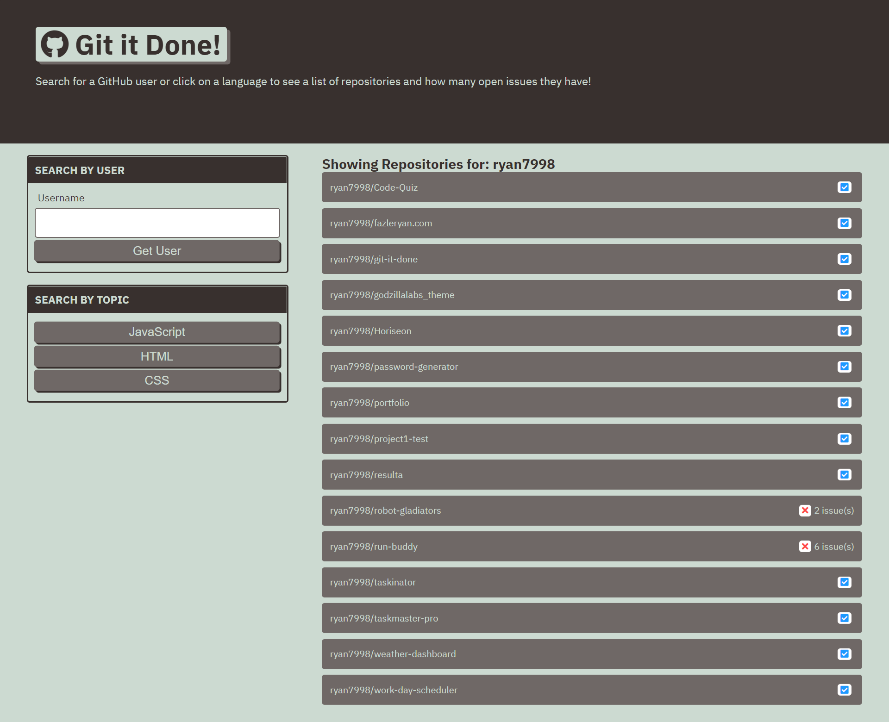

# git-it-done

## Screenshot:

## Description:
Git it done is a web app that will search GitHub for open source projects with open issues and pull requests. This project is a part of coding bootcamp course at UofT. Necessary JavaScript logic was developed to display GitHub repositories and their open issue counts based on a user’s search.

## Link to the site: 
https://ryan7998.github.io/git-it-done/